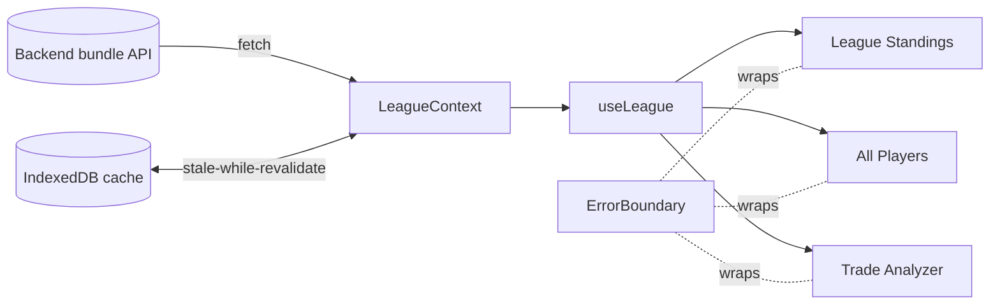

# Sleeper Fantasy Football Dashboard

A React + TypeScript single-page app for fantasy and dynasty football that pairs
**KeepTradeCut** player valuations with live **Sleeper** league data. It renders
league standings, a sortable player universe, and an AI-assisted trade analyzer —
with instant paints via an offline-first cache layer.

**[Live site](https://sleeper-dashboard-xi.vercel.app/)**

## Features

- **League Standings** — expandable team cards with points, efficiency, and
  differential; column headers have tooltips and key stats are color-coded by
  league-relative rank so standings read at a glance.
- **All Players** — a sortable, filterable grid over the full player universe with
  valuations from **KeepTradeCut** and **FantasyCalc**, value trend, and a live
  Tight-End-Premium selector.
- **Trade Analyzer** — build multi-asset proposals (players + picks) and get an
  AI-graded breakdown, with structured feedback capture.
- **Offline-first** — instant paints from an IndexedDB cache (stale-while-
  revalidate); active tab, sort, and in-progress trades persist across navigation.
- **Configurable** — switch leagues, formats, and scoring tiers; the UI adapts
  available positions and valuations to the league.
- **Resilient** — a top-level error boundary and retryable error states keep
  failures recoverable instead of white-screening.

## Architecture

A client-only SPA. A single `LeagueContext` owns data: it reads the saved league
from IndexedDB, paints the cached bundle, fetches the fresh bundle from the
backend, normalizes it, and writes it back. Components consume it through the
`useLeague()` hook.



The app consumes `GET /api/dashboard/league/:id` from a **separate backend**
(`http://localhost:5001/api` in dev, `VITE_API_URL` in production — see
`src/apiConfig.ts`). The browser never talks to Redis or Postgres directly. See
[`CLAUDE.md`](CLAUDE.md) for the module map and IndexedDB schema.

## Tech stack

- **Framework:** React 19, TypeScript, [Vite](https://vitejs.dev/)
- **Styling:** Tailwind CSS v4 (configured in CSS, no separate config file)
- **Client storage:** IndexedDB via [`idb`](https://github.com/jakearchibald/idb)
- **Charts/icons:** Recharts, Heroicons, Lucide
- **Testing:** Vitest + Testing Library (`jsdom`, `fake-indexeddb`)

## Quick start

```bash
nvm use            # Node version from .nvmrc
npm install
npm run dev        # Vite dev server
```

On first visit, pick an **Example league** (2024–2026 saved IDs) or paste your
own; the choice is stored in IndexedDB. Point the app at a backend by setting
`VITE_API_URL` (defaults to `http://localhost:5001/api` in dev).

## Testing & quality

```bash
npx vitest run     # unit tests (single CI-style run)
npm run lint       # ESLint
npm run build      # tsc typecheck + production build
```

CI (`.github/workflows/ci.yml`) runs lint, typecheck, and tests on push / pull
request.
